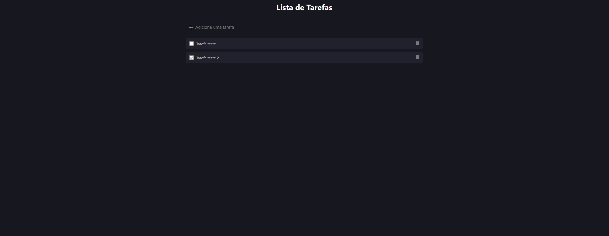

<h1 align="center">Lista de Tarefas 📝</h1>


## O projeto 🚧

Projeto criado na semana chamada "5 em 5" que visa desenvolver 5 projetos em 5 dias utilizando React com Typescript, o projeto sofreu algumas alterações minhas.

<br />

## Tecnologias e Bibliotecas ⚛

- [React](https://pt-br.reactjs.org)
- [TypeScript](https://www.typescriptlang.org)
- [Material-UI](https://mui.com/pt/)

<br />

## Como usar 👩‍💻

- Primeiro execute o comando 
   ```git clone https://github.com/hash-luk/react-to-do-list.git ```
- Depois abra o projeto no seu editor de código. Eu recomendo o [VSCode]()
- Abra um terminal na pasta do projeto e digite 
   ```npm start```
- Agora acesse o <b>localhost:3000</b>

<br />

## Imagem 📷




<br />
<br />
<br />
<br />

<footer>
<p align="center">Feito pela B7W e editado por Lucas P. ❤</p>
</footer>
